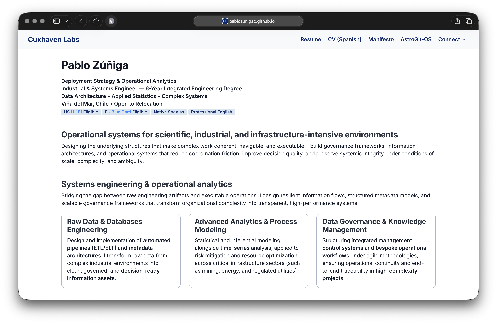

# Professional Positioning System

## Pablo Zúñiga
**Industrial & Systems Engineer PUCV, BSc & MSc Equivalent  
Data Modeling · Applied Statistics · Complex Systems  
Valparaíso, Chile · Open to Relocation · US H-1B1 & ESTA Eligible**  
`Native Spanish` · `Professional English`

---

## Architecture of pablozunigac.github.io
Centralized routing via `index.qmd` manages dynamic documentation, architectural specifications, and live deployments through a single entry point.

Built as a **Docs-as-Code** system, it delivers bilingual (`US/Global` & `Hispanophone`) technical documentation using modular **Quarto** compilation and automated CI/CD pipelines.



### Core Repository Structure

```bash
pablozunigac.github.io/
├── _quarto.yml             # Core Quarto project architecture and multi-format compilation settings
├── index.qmd               # Main landing portal (executive summary, positionings, and core credentials)
├── resume.qmd              # High-density, single-page resume source targeting automated ATS parsers
├── cv.qmd                  # Comprehensive technical curriculum vitae with extended project history
├── manifesto.qmd           # Engineering philosophy, architectural principles, and strategic vision
├── styles.css              # Global CSS layer overriding Quarto defaults and mapping design system tokens
├── en/                     # Internationalization directory: English market localization endpoints
├── es/                     # Internationalization directory: LATAM/Spanish market localization endpoints
├── images/                 # Optimized visual assets, project diagrams, and profile media artifacts
├── tokens/                 # Design System Token Architecture (Design-as-Code engine)
│   ├── colors.css          # Primitive color scales (50-950) and semantic light/dark mode properties
│   ├── fonts.css           # Multi-line webfont preloading and local font-face CDN import bindings
│   └── typography.css      # Typographic stacks for Sans, Serif, and Monospaced code suites
├── atelier/                # Digital sandbox for experiemntal content & editorial frameworks
└── .github/workflows/      # GitHub Actions CI/CD automation and deployment workflows
    └── deploy.yml          # Continuous Deployment: Production build release pipeline to GitHub Pages CDN
```

---

## Manifesto Abstract
**Ode to the Death of a Resume that had no Business Being Born**  
Static *résumés* and traditional portfolios fail to capture dynamic systems and polymathic minds. This platform replaces rigid formats with an operational, **Docs-as-Code** framework designed to process high-density technical narrative, govern architectural intent, and maintain structural coherence against **speed**, **hype**, and **scale**.

---

## First Principles: Logic, Language, Meaning

### Logic as Infrastructure
The foundation of every effective system is structure. Before information can be communicated, analyzed, or acted upon, it must first be organized through clear definitions, relationships, and boundaries. My work begins by transforming ambiguity into coherent architectures that make complexity understandable, navigable, and operationally useful.  

**_Conceptual Foundations:_** `Set Theory` · `Ontologies` · `Systems Theory`

### Language as the Interface
Systems only create value when people can interact with them effectively. Language serves as the interface between structure and execution, shaping how information is interpreted, communicated, and applied. Through semantic precision, documentation, and information design, I build environments where coordination becomes clearer, faster, and more reliable.  

**_Conceptual Foundations:_** `Semantics` · `Information Architecture` · `Human–Computer Interaction`

### Meaning as the Product
The ultimate objective is not information, but understanding. Every framework, process, document, or model exists to support better decisions and more coherent action. Meaning emerges when structure and communication align, transforming complexity into insight and insight into tangible outcomes.  

**_Conceptual Foundations:_** `Decision Theory` · `Sensemaking` · `Organizational Learning`

---

**Last Update:** <span id="timestamp_en">2026-08-18, 21:09 UTC</span>  
**© 2026 Cuxhaven Labs.** MIT License.
